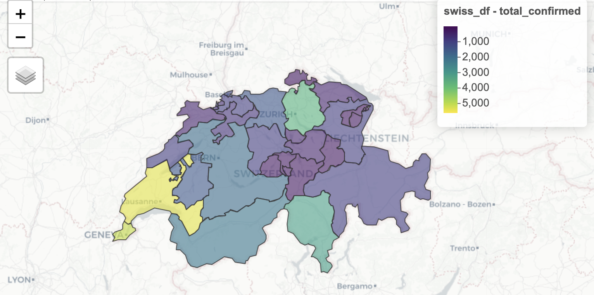

<!-- README.md is generated from README.Rmd. Please edit that file -->

# covid19swiss

<!-- badges: start -->

[](https://github.com/covid19r/covid19swiss/actions?query=workflow%3Abuild)
[](https://cran.r-project.org/package=covid19swiss)
[](https://www.tidyverse.org/lifecycle/#experimental)
[](https://opensource.org/licenses/MIT)
[](https://github.com/covid19r/covid19swiss/commit/master)
<!-- badges: end  -->

The covid19swiss R package provides a tidy format dataset of the 2019
Novel Coronavirus COVID-19 (2019-nCoV) pandemic outbreak in Switzerland
cantons and the Principality of Liechtenstein (FL). The package is
following the data structure of the [Covid19R
project](https://covid19r.github.io/documentation/data-format-standard.html).

</a>

The `covid19swiss` dataset includes the following fields:

  - `date` - the timestamp of the case, a `Date` object
  - `location` - the **Cantons of Switzerland** and **the Principality
    of Liechtenstein** (FL) abbreviation code
  - `location_type` - description of the location, either **Canton of
    Switzerland** or **the Principality of echtenstein**
  - `location_code` - a canton index code for merging geometry data from
    the rnaturalearth package, ailable only for Switzerland cantons
  - `location_code_type` - the name of code in the **rnaturalearth**
    package for Switzerland map
  - `data_type` - the type of case
  - `value` - the number of cases corresponding to the `date` and
    `data_type` fields

Where the available `data_type` field includes the following cases:

  - `tested_total` - cumulative number of tests performed as of the date
  - `cases_total` - cumulative confirmed Covid-19 cases as of the
    current date
  - `hosp_new` - new hospitalizations on the current date
  - `hosp_current` - current number of hospitalized patients as of the
    current date
  - `icu_current` - number of hospitalized patients in ICUs as of the
    current date
  - `vent_current` - number of hospitalized patients requiring
    ventilation as of the current date
  - `recovered_total` - cumulative number of patients recovered as of
    the current date
  - `deaths_total` - cumulative deaths due to Covid-19 as of the current
    date

More information can be found the following vignettes:

  - [Introduction to the covid19swiss
    Dataset](https://covid19r.github.io/covid19swiss/articles/intro_covid19swiss.html)
  - [Updating the covid19swiss
    Dataset](https://covid19r.github.io/covid19swiss/articles/update_the_data.html)
  - [Geospatial Visualization of Switzerland
    Cantons](https://covid19r.github.io/covid19swiss/articles/spatial_dataviz.html)
    (non CRAN vignette)

Data source: [Specialist Unit for Open Government Data Canton of
Zurich](https://www.zh.ch/de/politik-staat/opendata.html), raw data is
available on the following
[repository](https://github.com/openZH/covid_19). Special thanks for all
the people that collaborate and contribute to pull the data from
multiple sources and make this data available\!

## Installation

You can install the released version of covid19swiss from CRAN with:

``` r
install.packages("covid19swiss")
```

Or, install the most recent version from
[GitHub](https://github.com/Covid19R/covid19swiss) with:

``` r
# install.packages("devtools")
devtools::install_github("Covid19R/covid19swiss")
```

## Data refresh

The **covid19swiss** package dev version is been updated on a daily
bases. The `update_swiss_data` function enables a simple refresh of the
installed package datasets with the most updated version on Github:

``` r
library(covid19swiss)

update_swiss_data()
```

More information about updating the data is available on this
[vignette](https://covid19r.github.io/covid19swiss/articles/update_the_data.html)

**Note:** must restart the R session after using the `update_swiss_data`
function in order to have the updates available

## Usage

``` r
data(covid19swiss)

head(covid19swiss)
#>         date location         location_type location_code location_code_type    data_type value
#> 1 2020-01-24       GE Canton of Switzerland         CH.GE         gn_a1_code tested_total     4
#> 2 2020-01-24       GE Canton of Switzerland         CH.GE         gn_a1_code  cases_total    NA
#> 3 2020-01-24       GE Canton of Switzerland         CH.GE         gn_a1_code     hosp_new    NA
#> 4 2020-01-24       GE Canton of Switzerland         CH.GE         gn_a1_code hosp_current    NA
#> 5 2020-01-24       GE Canton of Switzerland         CH.GE         gn_a1_code  icu_current    NA
#> 6 2020-01-24       GE Canton of Switzerland         CH.GE         gn_a1_code vent_current    NA
```

### Wide format

``` r
library(tidyr)

covid19swiss_wide <- covid19swiss %>% 
  pivot_wider(names_from = data_type, values_from = value)

head(covid19swiss_wide)
#> # A tibble: 6 x 13
#>   date       location location_type         location_code location_code_type tested_total cases_total hosp_new hosp_current icu_current vent_current recovered_total deaths_total
#>   <date>     <chr>    <chr>                 <chr>         <chr>                     <int>       <int>    <int>        <int>       <int>        <int>           <int>        <int>
#> 1 2020-01-24 GE       Canton of Switzerland CH.GE         gn_a1_code                    4          NA       NA           NA          NA           NA              NA           NA
#> 2 2020-01-25 GE       Canton of Switzerland CH.GE         gn_a1_code                    8          NA       NA           NA          NA           NA              NA           NA
#> 3 2020-01-26 GE       Canton of Switzerland CH.GE         gn_a1_code                   11          NA       NA           NA          NA           NA              NA           NA
#> 4 2020-01-27 GE       Canton of Switzerland CH.GE         gn_a1_code                   18          NA       NA           NA          NA           NA              NA           NA
#> 5 2020-01-28 GE       Canton of Switzerland CH.GE         gn_a1_code                   27          NA       NA           NA          NA           NA              NA           NA
#> 6 2020-01-29 GE       Canton of Switzerland CH.GE         gn_a1_code                   54          NA       NA           NA          NA           NA              NA           NA
```

## Missing values

The data is collected from multiple resources on the canton level, and
not necessarily each data resource provides the same field. Therefore,
some fields, such as total recovered or total tested may not be
available at this point for some cantons and are marked as missing
values (i.e., `NA`).

## Contributing

Please submit [issues](https://github.com/Covid19R/covid19swiss/issues)
and [pull requests](https://github.com/Covid19R/covid19swiss/pulls) with
any package improvements\!

Please note that the ‘covid19swiss’ project is released with a
[Contributor Code of
Conduct](https://github.com/Covid19R/covid19swiss/blob/master/CODE_OF_CONDUCT.md).
By contributing to this project, you agree to abide by its terms.
